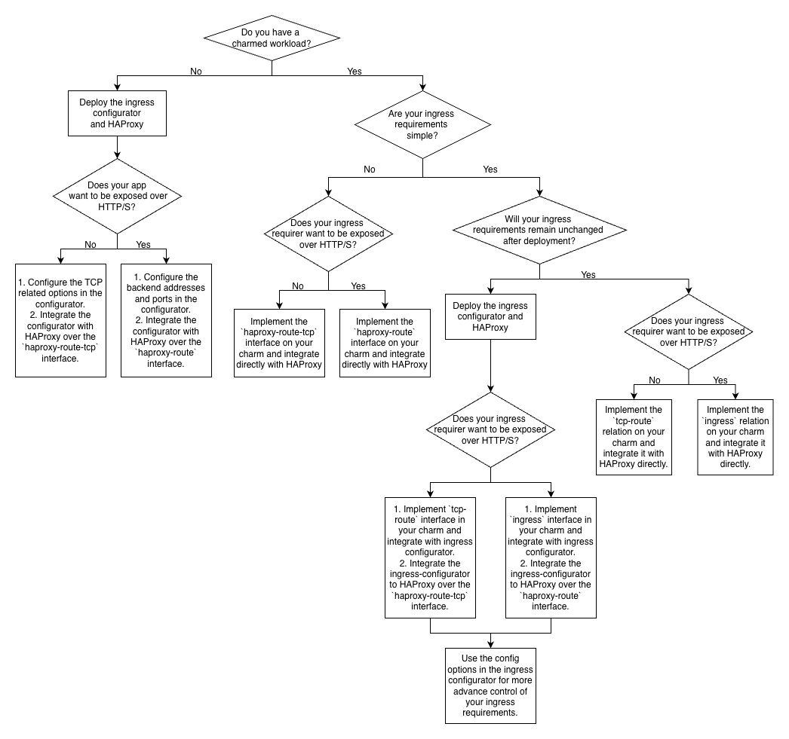

# Choosing the right HAProxy integration for your workload

As more teams adopt the HAProxy charm, and with the decision to use it as the front door for the Canonical PS7 infrastructure, the charm has become more critical than ever. HAProxy provides multiple integration interfaces, each designed for different levels of control and different workload types. Choosing the right interface depends on your application’s requirements and operational model.

This post presents the different interfaces provided by the HAProxy charm and the best HAProxy setup for various use cases.

## HAProxy interfaces

The following interfaces are provided by HAProxy:

### `ingress`

The `ingress` interface is a controller-independent interface that provides HTTP/HTTPS routing to an application, including 
load balancing across all units. It is designed to be simple to use:

* The requirer instantiates the ingress requirer class.
* The requirer receives an ingress URL.

This is the recommended default for most HTTP workloads.

### `ingress-per-unit`

Some applications require a cluster unique endpoint per Juju unit. The `ingress-per-unit` interface provides this capability. 
This is typically used when units must be individually addressable. For example: Prometheus, where each remote-write endpoint needs to be routed to separately.

### `haproxy-route`

The `haproxy-route` interface is an advanced alternative to `ingress`. It provides fine-grained control over how traffic is routed and handled by HAProxy.

Examples of supported advanced features include:
* Path and header rewrites
* Retry configuration
* Health check configuration
* Load balancing algorithm selection
* Timeout configuration

This interface is HAProxy-specific and should be used only when:
* Advanced features are required which are not supported by the `ingress` relation.
* Your application’s ingress requirements change during the charm lifecycle, and the charm must update those requirements dynamically.

### `tcp-ingress` (Planned)

The `tcp-ingress` interface will be a controller-independent interface (similar to `ingress`) which is designed for TCP routing. Note that this interface is not yet implemented but is planned for an upcoming development cycle.

### `haproxy-route-tcp`

The `haproxy-route-tcp` interface is the advanced equivalent of `tcp-ingress`. It allows HAProxy to provide TCP routing with fine-grained control. This interface is specific to HAProxy and will be able to exist in parallel with either the `haproxy-route` or `ingress` relations.

### `reverseproxy`

The `reverseproxy` interface exists only for compatibility with applications that integrated with the legacy HAProxy charm. It is intended to support lift-and-shift migrations.

Things to note about this interface:

* Only relation compatibility is supported (not configuration options).
* When `reverseproxy` is enabled, the charm does not support managing other integrations.
* Using `reverseproxy` alongside `ingress`, `ingress-per-unit`, `haproxy-route`, or `haproxy-route-tcp` will block the charm.

This interface will be deprecated in the future.

## Relation compatibility

Here is a table that shows which of these relations can simultaneously exist with each other and under what conditions:

| reverseproxy | ingress           | haproxy-route | haproxy-route-tcp | Valid configuration? |
|--------------|-------------------|---------------|-------------------|----------------------|
| yes          |                   |(at least 1 yes)|                  | no                   |
| yes          |                   | no             |                  | yes                  |
| no           | yes               | no            | yes               | yes (request for port 80 and 443 is not possible) |
| no           | no                | yes           | yes               | yes (request for port 80 and 443 is not possible) |
| no           |                   |               | yes               | yes (every valid port is available to be requested) |
| no           | yes               | yes           | any               | no                   |

## Simplifying integrations with the configurator pattern

The `haproxy-route` relation provides more flexibility and control over how the backend workload is exposed than the generic `ingress` interface. However, workload charms that implement the `haproxy-route` relation often introduce additional charm configuration options to control how HAProxy exposes the workload. This is not considered best practice, as it is not the responsibility of the workload charm to directly configure how it’s exposed. 

Moreover, there are some non-charmed workloads which are not part of the Juju ecosystem and still require an ingress.

### Ingress configurator operator

To address these concerns, we have developed the [ingress configurator](https://github.com/canonical/ingress-configurator-operator) operator, which provides the following modes:

* **Integrator mode**: For non-charmed workloads to request an ingress.
* **Adapter mode**: For applications to leverage the additional fine-grained configurations provided by the `haproxy-route` interface.

## Choosing the right HAProxy setup

The following flow chart will help you identify the ideal HAProxy setup for different use cases:

If you think your use case does not fit any of the above or are still unsure which interface is the best fit for you, please reach out to us on the [Platform Engineering](https://chat.canonical.com/canonical/channels/platform-engineering) channel. We’re always happy to help!
